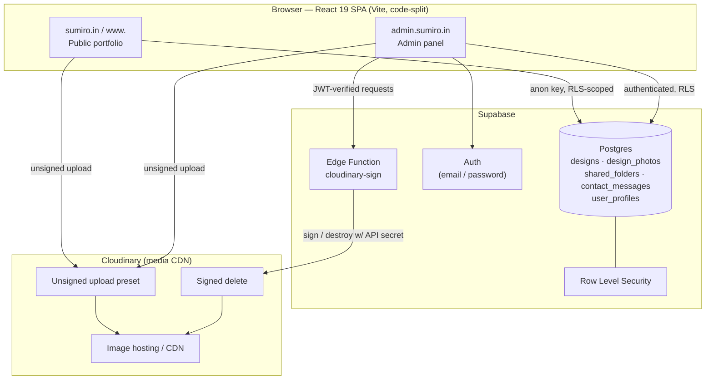
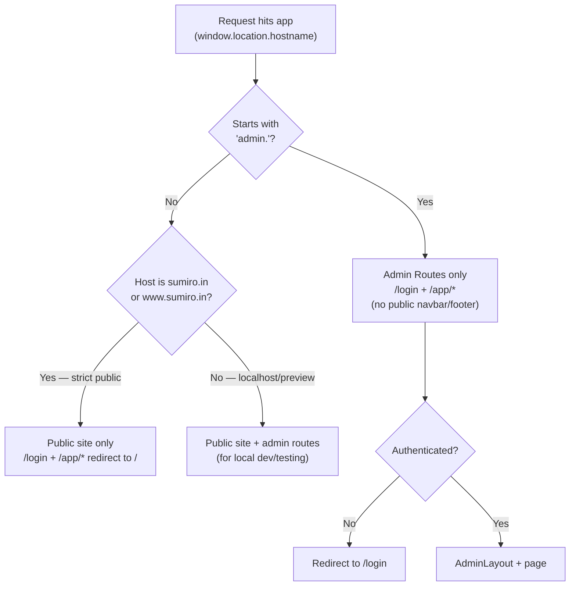
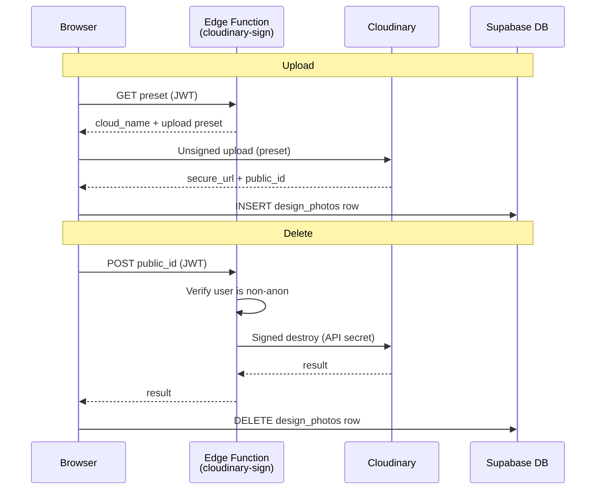

# The Sumiro — Architecture

This document describes the architecture of The Sumiro fabric-design platform: a
single-page React application backed by Supabase, with media hosted on Cloudinary.
It serves both a **public marketing/portfolio site** and a **private admin panel**
for managing designs, inventory, shared folders, and site content.

---

## 1. High-level overview



- The browser talks to Supabase directly using the public **anon key**; all access
  is constrained by **Row Level Security** policies.
- Image uploads go straight to Cloudinary via an unsigned preset; deletes and the
  preset lookup are brokered by a Supabase **Edge Function** that holds the
  Cloudinary API secret and verifies the caller is an authenticated (non-anon) user.

### Hostname-based routing



### Photo upload / delete sequence



---

## 2. Tech stack

| Layer        | Technology |
|--------------|------------|
| UI framework | React 19, React Router 7 |
| Build tool   | Vite 8 (Rolldown), code-split lazy routes |
| Styling      | Tailwind CSS 4 + inline styles, CSS variables for the design system |
| Animation    | framer-motion, custom CSS keyframes |
| 3D / visuals | three.js (fabric canvas) |
| Backend      | Supabase (Postgres, Auth, Edge Functions) |
| Media        | Cloudinary |
| Testing      | Vitest, Testing Library, fast-check |
| Lint         | ESLint 10 (react-hooks, react-refresh) |

---

## 3. Domain & routing model

Routing is decided at runtime by `window.location.hostname` in `src/App.jsx`:

- **`admin.` subdomain** → admin-only `Routes` (login + `/app/*`), no public
  navbar/footer.
- **`sumiro.in` / `www.sumiro.in`** (strict public) → public portfolio only;
  `/login` and `/app/*` redirect to `/`.
- **Anything else (localhost, previews)** → public site **plus** admin routes, for
  local development and testing.

Route groups:

| Path | Access | Layout |
|------|--------|--------|
| `/`, `/about`, `/contact` | Public | `PublicLayout` (Navbar + Footer) |
| `/maintenance` | Public, standalone | none |
| `*` (unmatched public) | Public | `PublicLayout` → `NotFoundPage` (404) |
| `/login` | Public (dev/admin only) | none |
| `/app/dashboard`, `/app/design/:id`, `/app/shared-folders`, `/app/inbox`, `/app/ticker`, `/app/settings` | Authenticated | `ProtectedRoute` → `AdminLayout` |

Pages are lazy-loaded via `React.lazy` + `Suspense`, so each route ships as its own
chunk.

---

## 4. Frontend structure

```
src/
├── main.jsx                # Entry — wraps <App> in <ErrorBoundary>
├── App.jsx                 # Providers, hostname routing, layouts
├── index.css / App.css     # Global styles + design-system CSS variables
│
├── pages/
│   ├── portfolio/          # HomePage, AboutPage, ContactPage,
│   │                       #   NotFoundPage, MaintenancePage
│   ├── auth/               # LoginPage
│   └── app/                # DashboardPage, DesignDetailPage,
│                           #   SharedFoldersPage, InboxPage,
│                           #   TickerPage, EnquirySettingsPage
│
├── components/
│   ├── layout/             # Navbar, Footer, AdminLayout
│   ├── auth/               # ProtectedRoute
│   ├── designs/            # DesignCard, DesignForm, PhotoGallery,
│   │                       #   FolderCountField, ShareFolderModal,
│   │                       #   EnquiryEditor, MarqueeEditor, InboxModal
│   ├── portfolio/          # HeroBanner, FabricCanvas (three.js)
│   └── ui/                 # Modal, Pagination, Spinner, Toast,
│                           #   ToastContainer, Reveal, Seo, ErrorBoundary,
│                           #   PlaceholderImage
│
├── contexts/               # AuthContext, SettingsContext, ToastContext
├── hooks/                  # useDesigns, useDesignDetail,
│                           #   useSharedFolders, useSettings
├── lib/                    # supabase.js (client), cloudinary.js (upload/delete)
└── utils/                  # formatters.js, validators.js
```

### State management

No external state library. State is composed from three React contexts plus
data-fetching hooks:

- **`AuthContext`** — wraps Supabase auth; exposes `user`, `profile`, `loading`,
  `signIn`, `signOut`. Resolves the initial session and subscribes to auth changes.
- **`SettingsContext`** — loads the `SYSTEM_SETTINGS` row (contact details, home
  video, collection slides, `maintenance_mode`) and exposes `settings` + `refetch`.
- **`ToastContext`** — global toast notifications.
- **Hooks** (`useDesigns`, `useDesignDetail`, `useSharedFolders`) encapsulate
  Supabase queries, pagination, search, and optimistic updates per feature.

---

## 5. Backend (Supabase)

### Data model (Postgres)

| Table | Purpose |
|-------|---------|
| `designs` | Core catalog. Also stores **system rows** keyed by `design_no` (`SYSTEM_SETTINGS`, `SYSTEM_MARQUEE`) whose JSON config lives in `description`. Inventory counts: `office_folder`, `bag_folder`, `extra_folder`. |
| `design_photos` | Photos per design (Cloudinary `secure_url` + `public_id`, `sort_order`). |
| `shared_folders` | Tracks physical folders shared with clients (party, city, count, rate, sent date, status). |
| `contact_messages` | Public contact-form submissions. |
| `user_profiles` | Admin/staff profiles with a `role` column. |

### Access control (RLS)

Row Level Security is enabled on every table:

- **Anonymous** users can read only `is_public = true` rows (public designs and the
  system settings/marquee rows) and can `INSERT` into `contact_messages`.
- **Authenticated** users can manage catalog content.
- **Admin-only** actions (e.g. deleting designs / shared folders) are gated by an
  `is_admin()` `SECURITY DEFINER` helper that checks `user_profiles.role`.
- `mark_folder_returned(folder_id)` is a `SECURITY DEFINER` RPC that atomically
  flips status and restores `extra_folder` using `SELECT ... FOR UPDATE`.
- All `SECURITY DEFINER` functions pin `search_path` (migration `012`) to prevent
  search-path hijacking.

Migrations live in `supabase/migrations/` (`001` → `012`) and are applied with
`supabase db push`.

### Edge Function — `cloudinary-sign`

A Deno function (`supabase/functions/cloudinary-sign/index.ts`) that:

1. **Verifies the caller** — decodes the JWT via `supabase.auth.getUser()` and
   rejects the anonymous role (the public anon key would otherwise pass gateway
   `verify_jwt`).
2. **GET** → returns `cloud_name` + upload preset for unsigned client uploads.
3. **POST** → signs and calls Cloudinary's `destroy` endpoint to delete an image by
   `public_id`.
4. Restricts CORS to an allowlist of known origins.

The Cloudinary **API secret never reaches the browser** — it lives only in Supabase
function secrets.

---

## 6. Media pipeline (Cloudinary)

```
Upload:  Browser ──(GET preset)──▶ cloudinary-sign ──▶ {cloud_name, preset}
         Browser ──(unsigned upload with preset)──▶ Cloudinary ──▶ secure_url, public_id
         Browser ──(insert row)──▶ Supabase design_photos

Delete:  Browser ──(POST public_id, JWT)──▶ cloudinary-sign ──(signed destroy)──▶ Cloudinary
         Browser ──(delete row)──▶ Supabase design_photos
```

`src/lib/cloudinary.js` handles client-side upload (with progress) and brokered
delete; watermarking for gallery downloads is done client-side in `PhotoGallery`.

---

## 7. Cross-cutting concerns

- **Error handling** — top-level `ErrorBoundary` (in `main.jsx`) catches render
  errors and shows a recovery screen instead of a blank page.
- **SEO** — rich base meta + Organization JSON-LD in `index.html`; a dependency-free
  `Seo` component sets per-page title/description/canonical/OG/Twitter tags;
  `robots.txt` (disallows `/login`, `/app/`) and `sitemap.xml` ship from `public/`.
- **Feature flags / settings** — stored as JSON in the `SYSTEM_SETTINGS` design row,
  edited from the admin Enquiry Settings page:
  - Contact details (phone, alt phone, email)
  - Home video URL + thumbnail
  - Collection slide images (with editable tag/title/subtitle)
  - **`maintenance_mode`** — when ON, `PublicLayout` redirects public visitors to
    `/maintenance`; authenticated admins bypass it; an admin banner shows the active
    state.
- **Inventory edit lock** — folder counts on a design are read-only until unlocked
  with a client-side password (`VITE_INVENTORY_PASSWORD`). This is a UI speed-bump;
  the real write boundary is Supabase auth + RLS.

---

## 8. Build & deployment

- **Build**: `npm run build` (Vite). Output in `dist/`. Vendor code is split into
  `react-vendor`, `supabase-vendor`, and `three-vendor` chunks for caching.
- **SPA fallback**: `public/_redirects` (Netlify) and `vercel.json` (Vercel) rewrite
  all paths to `index.html` so deep links survive refresh.
- **Frontend env vars**: `VITE_SUPABASE_URL`, `VITE_SUPABASE_ANON_KEY`,
  `VITE_INVENTORY_PASSWORD`.
- **Database**: `supabase db push` applies migrations.
- **Edge function**: `supabase functions deploy cloudinary-sign` + set Cloudinary
  secrets via `supabase secrets set`.
- **Domains**: point `sumiro.in`, `www.sumiro.in`, and `admin.sumiro.in` at the same
  deployment; the app branches on hostname.

---

## 9. Key request flows

**Public visitor views a design**
`HomePage`/catalog → `useDesigns` → Supabase (anon, `is_public = true` only) →
images served from Cloudinary CDN.

**Admin edits inventory**
`DesignDetailPage` → unlock with inventory password → `FolderCountField` →
`useDesignDetail.updateField` → Supabase `update` (RLS: authenticated) → optimistic
UI update.

**Admin shares a folder**
`ShareFolderModal` → insert into `shared_folders` + decrement `extra_folder`.
Later, "Mark Returned" → `mark_folder_returned` RPC (atomic status + restore).

**Contact form**
`ContactPage` → validate → insert into `contact_messages` (anon INSERT allowed) →
appears in admin `InboxPage` (realtime count badge in `AdminLayout`).
